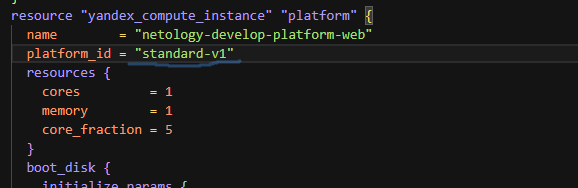

## Задача 1

>Ответ: при инициализации проекта в файле main.tf были обнаружены две ошибки: не верно указан параметр platform_id и для выбранного platform_id не верно указан параметр cores

>После устранения ошибок, код запустился успешно. Подключаемся к консоли ВМ через ssh и выполняем команду  curl ifconfig.me

>На скриншотах видно, что вывод команды curl ifconfig.me соответствует назначенному внешнему ip-адресу.

>Параметр preemptible = true позволяет сделать прерываемую ВМ, а параметр core_fraction=5 определяет долю вычислительного времени физических ядер, которую гарантирует vCPU. В данном случае она составит 5%. Установка таких параметров влияет на конечную стоимость ВМ делая ее минимальной.

## Задача 2

>Заменяем все хардкод-значения для ресурсов yandex_compute_image и yandex_compute_instance на отдельные переменные. Объявляем их в файле variables.tf

>После вносим необходимые изменения в файл main.tf

>Проверяем terraform plan. Изменений нет.

## Задача 3

>Создаем файл vms_platform.tf. Переносим в него все переменные первой ВМ и добавляем вторую ВМ. Запускаем terraform apply.

>Смотрим результат выполнения

## Задача 4

>Объявляем в файле outputs.tf один output , содержащий: instance_name, external_ip, fqdn для каждой из ВМ в удобном формате.(без хардкода!!!). Запускаем terraform apply. Вывод команды terraform output

## Задача 5

>В файле locals.tf описываем в одном local-блоке имя каждой ВМ, используя интерполяцию ${..} с НЕСКОЛЬКИМИ переменными.

>Заменяем переменные внутри ресурса ВМ на созданные нами local-переменные.

>Применяем изменения.

## Задача 6

>Вместо использования трёх переменных ".._cores",".._memory",".._core_fraction" в блоке resources {...}, объединяем их в две map-переменные (по одной на ресурс).

>Создадим отдельную общую map(object) переменную для блока metadata для всех ВМ. Также комментируем все более не используемые переменные проекта.

>Проверяем terraform plan. Изменений ожидаемо нет.

## Задача 7*

1. Напишите, какой командой можно отобразить второй элемент списка test_list.
>Ответ: команда local.test_list[1]

2. Найдите длину списка test_list с помощью функции length(<имя переменной>).

>Ответ: команда length(local.test_list)

3. Напишите, какой командой можно отобразить значение ключа admin из map test_map.

>Ответ: команда local.test_map.admin

4. Напишите interpolation-выражение, результатом которого будет: "John is admin for production server based on OS ubuntu-20-04 with X vcpu, Y ram and Z virtual disks", используйте данные из переменных test_list, test_map, servers и функцию length() для подстановки значений.

>Ответ: выражение "${local.test_map.admin} is admin for ${local.test_list[2]} server based on OS ${local.servers.production.image} with ${local.servers.production.cpu} vcpu, ${local.servers.production.ram} ram and ${length(local.servers.production.disks)} virtual disks"

## Задача 8*

1. Напишите и проверьте переменную test и полное описание ее type в соответствии со значением из terraform.tfvars:

2. Напишите выражение в terraform console, которое позволит вычленить строку "ssh -o 'StrictHostKeyChecking=no' ubuntu@62.84.124.117" из этой переменной.
>Ответ: выражение var.test[0].dev1[0]

## Задача 9*
