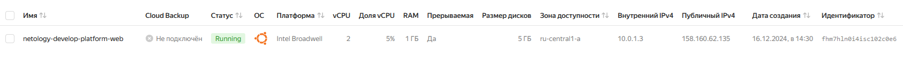
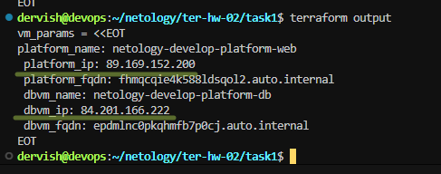

## Задача 1

>Ответ: при инициализации проекта в файле main.tf были обнаружены две ошибки: не верно указан параметр platform_id и для выбранного platform_id не верно указан параметр cores

>После устранения ошибок, код запустился успешно. Подключаемся к консоли ВМ через ssh и выполняем команду  curl ifconfig.me

>На скриншотах видно, что вывод команды curl ifconfig.me соответствует назначенному внешнему ip-адресу.

>Параметр preemptible = true позволяет сделать прерываемую ВМ, а параметр core_fraction=5 определяет долю вычислительного времени физических ядер, которую гарантирует vCPU. В данном случае она составит 5%. Установка таких параметров влияет на конечную стоимость ВМ делая ее минимальной.

## Задача 2

>Заменяем все хардкод-значения для ресурсов yandex_compute_image и yandex_compute_instance на отдельные переменные. Объявляем их в файле variables.tf

>После вносим необходимые изменения в файл main.tf

>Проверяем terraform plan. Изменений нет.

## Задача 3

>Создаем файл vms_platform.tf. Переносим в него все переменные первой ВМ и добавляем вторую ВМ. Запускаем terraform apply.

>Смотрим результат выполнения

## Задача 4

>Объявляем в файле outputs.tf один output , содержащий: instance_name, external_ip, fqdn для каждой из ВМ в удобном формате.(без хардкода!!!). Запускаем terraform apply. Вывод команды terraform output

## Задача 5

>В файле locals.tf описываем в одном local-блоке имя каждой ВМ, используя интерполяцию ${..} с НЕСКОЛЬКИМИ переменными.

>Заменяем переменные внутри ресурса ВМ на созданные нами local-переменные.

>Применяем изменения.

## Задача 6

